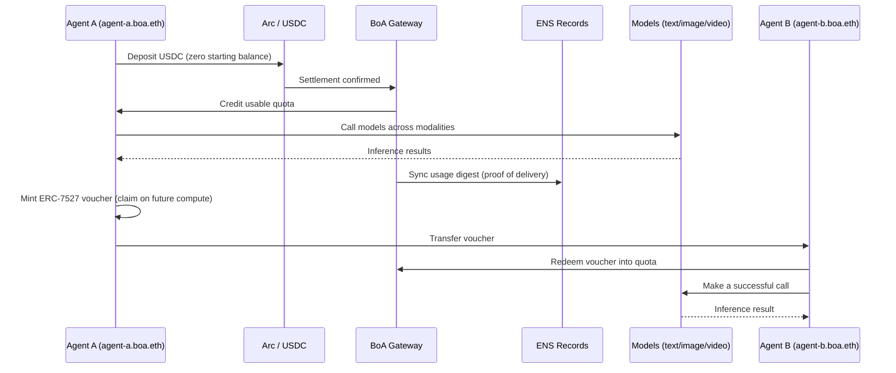

<p align="center">
  
</p>

<h1 align="center">Bank of Agent (BoA)</h1>

### The forward market for AI compute

Bank of Agent is an agent-native exchange that turns AI inference into a tradable
financial asset. Today compute is bought like a SaaS subscription: you pay per
call, your usage is locked inside a provider's private database, and the *right*
to use a model can't be priced, hedged, or resold. BoA makes inference a liquid
commodity by giving it the four things every real exchange has — a **unit of
account**, a **spot price**, a **forward curve**, and **verifiable delivery**.

> Spot settlement is live today. The forward curve and compute-as-collateral are
> the roadmap this architecture makes inevitable.

**Live demo** → [boa-web-demo.vercel.app](https://boa-web-demo.vercel.app) ·
**model gateway** → [boa-newapi-production.up.railway.app](https://boa-newapi-production.up.railway.app) ·
**contracts** → verified on Ethereum Sepolia ([addresses](#live-deployments))

---

## The problem

Inference is the largest new commodity of the decade, but it trades like a
phone plan:

- **No unit of account.** Every provider meters in its own tokens, credits, and
  tiers. There is no common denominator to price one model's output against
  another's.
- **No transferable right.** A prepaid balance is trapped in one account. You
  can't sell unused capacity, lend it, or post it as collateral.
- **No forward price.** You can't lock today's price for compute you'll need next
  month, so long-running agents carry unhedged cost risk.
- **No verifiable delivery.** Consumption lives in a SaaS log only the provider
  can read. No third party can audit what an agent actually used.

A commodity that can't be priced forward or verified independently isn't a
market — it's a subscription.

## The thesis: an exchange needs four parts

| Exchange primitive   | In Bank of Agent                                                                 |
| -------------------- | ------------------------------------------------------------------------------- |
| **Unit of account**  | One USDC balance and one metered quota across every modality (text/image/video/agents) |
| **Spot price**       | Live per-call metering against quota through a single gateway                    |
| **Forward curve**    | The ERC-7527 voucher market — a transferable claim on *future* inference, priced by FOAMM |
| **Verifiable delivery** | A usage digest written back to the agent's ENS records, auditable by anyone   |

## How it works

BoA aggregates every model type behind **one gateway** and **one USDC balance**.

1. **Identity.** An agent gets an ENS identity — `agent-a.boa.eth` — as its
   account handle and its public audit trail.
2. **Deposit.** The agent deposits USDC over **Arc**. No KYC, no signup,
   permissionless by construction.
3. **Credit.** BoA credits usable **quota** against that balance.
4. **Consume.** The agent calls models across modalities — text, image, video,
   other agents — all drawn from the same balance.
5. **Prove.** Every call is metered and a **usage digest** is synced back to the
   agent's ENS records, so consumption history is verifiable by any third party
   instead of being trapped in a provider's log.

## The core: a claim on future compute

The center of BoA is the **ERC-7527 voucher**. It is not a prepaid card. It is a
*transferable claim on future inference at terms struck today* — a future/option
on compute.

- **Priced by demand.** ERC-7527's **FOAMM** (Function Oracle Automated Market
  Maker) premium function prices each voucher against live demand. As capacity is
  claimed, the premium rises along a deterministic curve.
- **A forward curve falls out.** Because each voucher's premium reflects the
  market's live demand for future capacity, the voucher market *emits a forward
  curve*: the premium on future model capacity is the market's forecast of its
  scarcity.
- **Compute becomes a balance-sheet asset.** Agents lock prices for long tasks,
  resellers warehouse capacity, and the access right itself becomes collateral —
  the on-ramp to agent credit and DeFi.

This is the difference between *spending* on compute and *holding a position* in
it.

## The hackathon build — a full end-to-end loop

The demo runs the complete primitive end to end:



Step by step:

1. An agent with an ENS identity and **zero balance** deposits USDC on Arc.
2. BoA credits quota.
3. The agent calls models across **multiple modalities** against one balance.
4. Usage is metered and a **proof digest syncs to ENS**.
5. The agent **mints an ERC-7527 voucher** and transfers it to a second agent.
6. The second agent **redeems it into quota** and immediately makes a successful
   call.

That last step is the primitive the entire futures thesis is built on: **a priced
claim on future compute changing hands before anyone consumes it.**

## Architecture

```
                 ┌──────────────────────────────────────────────┐
                 │                  BoA Gateway                   │
                 │   one USDC balance · one metered quota · all   │
                 │        modalities (text/image/video/agents)    │
                 └───────┬───────────────┬───────────────┬───────┘
                         │               │               │
              ┌──────────▼───┐   ┌───────▼──────┐  ┌─────▼─────────┐
              │   Arc / USDC  │   │ ENS Identity │  │   ERC-7527    │
              │   settlement  │   │  + usage     │  │   voucher     │
              │  (deposit →   │   │  digest      │  │  (FOAMM-priced│
              │    quota)     │   │ (verifiable  │  │   claim on    │
              │               │   │  delivery)   │  │   future use) │
              └───────────────┘   └──────────────┘  └───────────────┘
```

- **Settlement layer — Arc + USDC.** Permissionless deposits convert a stablecoin
  balance into usable quota; agent-to-agent calls settle pay-per-use over the
  **x402** protocol (USDC on Arc, no human in the loop).
- **Identity & delivery layer — ENS.** Each agent is a real ENS subname; metered
  usage digests are written back as text records for independent verification.
- **Proof layer — Hedera HCS.** Every call becomes a router-signed usage receipt
  anchored to a Hedera Consensus Service topic — a tamper-evident, on-chain twin
  of the ENS usage digest.
- **Forward layer — ERC-7527 + FOAMM.** Vouchers are minted, transferred, and
  redeemed as transferable claims on future inference, priced by the FOAMM
  premium curve. (See the sibling [`EIP7527`](https://github.com/lanyinzly/EIP7527)
  repo for the `Agency` / `App` / `Factory` contract implementation.)
- **Aggregation layer — the gateway/relay.** A single **OpenAI- and
  Anthropic-compatible** endpoint fronts every model and modality, drawing from
  one balance, enforcing quota, and emitting one signed metering stream.

## What's in this repo

BoA is a small monorepo of independently runnable services plus a frontend. Every
Node service runs TypeScript directly on **Node 22** (`node <dir>`) with **no build
step**.

| Path | What it is |
| --- | --- |
| [`relay/`](./relay) | **The spine.** An OpenAI- *and* Anthropic-compatible gateway in front of the ERC-7527 FOAMM market: resolves identity, enforces membership/quota (`402` if none), forwards to the model, meters tokens, settles USDC, and returns an ECDSA-signed usage receipt (`x-boa-usage`). Runs zero-config in `memory` mode or `onchain` against the live contracts. |
| [`contracts/`](./contracts) | The **ERC-7527 FOAMM** stack (`Agency`/`App`/`Factory`) + a Foundry deploy script. Vendored byte-for-byte from the sibling [`EIP7527`](https://github.com/lanyinzly/EIP7527) repo; deployed and verified live on Ethereum Sepolia. |
| [`boa-ens-service/`](./boa-ens-service) | **Real Sepolia ENS** identity & discovery: mints subnames + writes text records (streamed over SSE), discovers the agent fleet live from on-chain `NewOwner` logs (no database), resolves any name via the Universal Resolver. Mints are operator-signed (users pay **zero gas**), with an optional self-custody claim. |
| [`boa-arc-service/`](./boa-arc-service) | **Agent-native price discovery + x402 USDC settlement on Arc** (Circle Agent Stack): a FOAMM-style bonding curve quotes each tool; `402 → pay USDC on Arc → retry with an X-PAYMENT proof` settles real, human-free, agent-to-agent payments. |
| [`web/`](./web) | The **React + Vite + GSAP** demo of the full economic loop, with a live FOAMM price dock. Ships an in-browser **MSW mock relay** so it runs with zero backend; flip one env var (`NEXT_PUBLIC_RELAY_URL`) to go live. |
| [`spikes/`](./spikes) | Sprint-0 go/no-go proofs for each external rail — **Arc** settlement, **ENS** records, and a **Hedera HCS** proof rail (signed, tamper-evident usage receipts) — all verified PASS. |

## Run it locally

**The full closed loop (relay + demo), zero config:**

```bash
cd relay && npm install
node ../relay        # gateway on :8787 (memory mode, external rails stubbed)
npm run demo         # in another shell — buy → call → transfer → redeem → call
```

**The web demo (offline-capable, mock relay runs in the browser):**

```bash
cd web && npm install
npm run dev          # open the printed URL (default http://localhost:5173)
```

**Contracts (Foundry):**

```bash
cd contracts
make deps && make build && make test
make deploy-sepolia  # or deploy-base / deploy-local; writes deployments.json
```

Each service carries its own README with full configuration (`relay/`,
`contracts/`, `boa-ens-service/`, `boa-arc-service/`, `web/`).

## Live deployments

- **Web demo:** <https://boa-web-demo.vercel.app> (Vercel)
- **Model gateway (New API):** <https://boa-newapi-production.up.railway.app> (Railway)
- **ERC-7527 FOAMM market — Ethereum Sepolia (chainId 11155111):**

| Contract | Address |
| --- | --- |
| Factory | [`0x7f22C05da2F4C9063477dA14101D2c56D510785E`](https://sepolia.etherscan.io/address/0x7f22C05da2F4C9063477dA14101D2c56D510785E) |
| Market — Agency (wrap/unwrap) | [`0x47d5b439FdC1Bb59ee1A6Ae7bfDED8e246ee33EE`](https://sepolia.etherscan.io/address/0x47d5b439FdC1Bb59ee1A6Ae7bfDED8e246ee33EE) |
| Market — App (ERC-721 voucher) | [`0xc72e56656266dA245276336DCA0c861F0A2739B4`](https://sepolia.etherscan.io/address/0xc72e56656266dA245276336DCA0c861F0A2739B4) |

The FOAMM was exercised on-chain (premium rises on `wrap`, refund on `unwrap`) —
see [`contracts/README.md`](./contracts/README.md) for the implementation
addresses and the live transaction hashes.

## Tech stack

**Partner technologies**

- **ENS** — agent identity and verifiable usage records (real Sepolia subnames).
- **Circle — Arc · USDC · x402** — permissionless USDC settlement rail, the unit
  of account, and the agent-to-agent pay-per-call protocol.
- **Hedera — HCS / HTS** — tamper-evident, signed proof-of-consumption.
- **ERC-7527 + FOAMM** — the transferable voucher standard and the bonding-curve
  premium function that prices it and emits the forward curve.

**Engineering**

- **Node 22** running TypeScript natively (no build step), **Express** services.
- **Solidity + Foundry** (forge/anvil/cast), OpenZeppelin v5; **viem** & **ethers v6**.
- **React 18 + Vite 5 + GSAP**, with **MSW** as an in-browser mock relay.
- **New API** upstream model gateway; an OpenAI- & Anthropic-compatible relay shim.
- **Docker**, deployed on **Railway** (services) and **Vercel** (web).

## Roadmap

- **Live today:** spot settlement — deposit, quota, multi-modal calls, ENS-synced
  proof of delivery, and voucher mint/transfer/redeem.
- **Next — the forward curve:** surface the FOAMM premiums across maturities as a
  tradable term structure for compute.
- **Then — compute as collateral:** use the voucher (a priced, verifiable access
  right) as a balance-sheet asset to back agent credit and DeFi positions.

## Why it matters

When inference has a unit of account, a spot price, a forward curve, and
verifiable delivery, "the right to think" becomes a financial asset agents can
price, hedge, trade, and borrow against. Bank of Agent is the exchange that makes
that market.

---

*Built at ETHNYC.*
