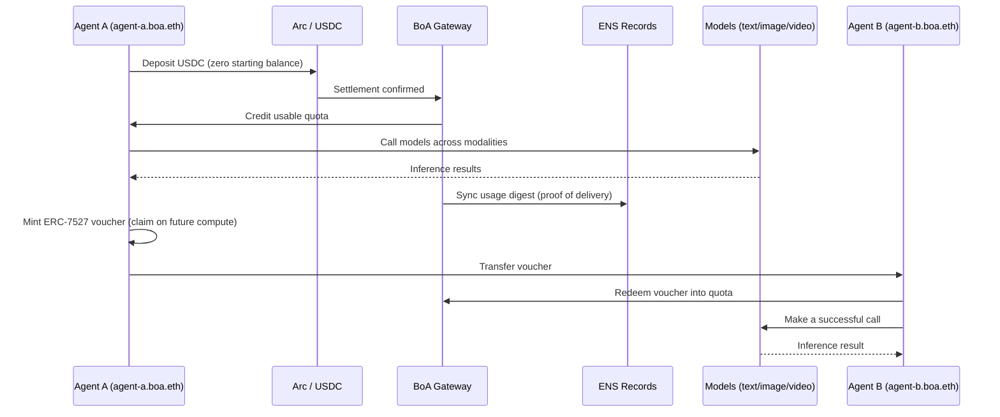

# Bank of Agent (BoA)

### The forward market for AI compute

Bank of Agent is an agent-native exchange that turns AI inference into a tradable
financial asset. Today compute is bought like a SaaS subscription: you pay per
call, your usage is locked inside a provider's private database, and the *right*
to use a model can't be priced, hedged, or resold. BoA makes inference a liquid
commodity by giving it the four things every real exchange has — a **unit of
account**, a **spot price**, a **forward curve**, and **verifiable delivery**.

> Spot settlement is live today. The forward curve and compute-as-collateral are
> the roadmap this architecture makes inevitable.

---

## The problem

Inference is the largest new commodity of the decade, but it trades like a
phone plan:

- **No unit of account.** Every provider meters in its own tokens, credits, and
  tiers. There is no common denominator to price one model's output against
  another's.
- **No transferable right.** A prepaid balance is trapped in one account. You
  can't sell unused capacity, lend it, or post it as collateral.
- **No forward price.** You can't lock today's price for compute you'll need next
  month, so long-running agents carry unhedged cost risk.
- **No verifiable delivery.** Consumption lives in a SaaS log only the provider
  can read. No third party can audit what an agent actually used.

A commodity that can't be priced forward or verified independently isn't a
market — it's a subscription.

## The thesis: an exchange needs four parts

| Exchange primitive   | In Bank of Agent                                                                 |
| -------------------- | ------------------------------------------------------------------------------- |
| **Unit of account**  | One USDC balance and one metered quota across every modality (text/image/video/agents) |
| **Spot price**       | Live per-call metering against quota through a single gateway                    |
| **Forward curve**    | The ERC-7527 voucher market — a transferable claim on *future* inference, priced by FOAMM |
| **Verifiable delivery** | A usage digest written back to the agent's ENS records, auditable by anyone   |

## How it works

BoA aggregates every model type behind **one gateway** and **one USDC balance**.

1. **Identity.** An agent gets an ENS identity — `agent-a.boa.eth` — as its
   account handle and its public audit trail.
2. **Deposit.** The agent deposits USDC over **Arc**. No KYC, no signup,
   permissionless by construction.
3. **Credit.** BoA credits usable **quota** against that balance.
4. **Consume.** The agent calls models across modalities — text, image, video,
   other agents — all drawn from the same balance.
5. **Prove.** Every call is metered and a **usage digest** is synced back to the
   agent's ENS records, so consumption history is verifiable by any third party
   instead of being trapped in a provider's log.

## The core: a claim on future compute

The center of BoA is the **ERC-7527 voucher**. It is not a prepaid card. It is a
*transferable claim on future inference at terms struck today* — a future/option
on compute.

- **Priced by demand.** ERC-7527's **FOAMM** (Function Oracle Automated Market
  Maker) premium function prices each voucher against live demand. As capacity is
  claimed, the premium rises along a deterministic curve.
- **A forward curve falls out.** Because each voucher's premium reflects the
  market's live demand for future capacity, the voucher market *emits a forward
  curve*: the premium on future model capacity is the market's forecast of its
  scarcity.
- **Compute becomes a balance-sheet asset.** Agents lock prices for long tasks,
  resellers warehouse capacity, and the access right itself becomes collateral —
  the on-ramp to agent credit and DeFi.

This is the difference between *spending* on compute and *holding a position* in
it.

## The hackathon build — a full end-to-end loop

The demo runs the complete primitive end to end:



Step by step:

1. An agent with an ENS identity and **zero balance** deposits USDC on Arc.
2. BoA credits quota.
3. The agent calls models across **multiple modalities** against one balance.
4. Usage is metered and a **proof digest syncs to ENS**.
5. The agent **mints an ERC-7527 voucher** and transfers it to a second agent.
6. The second agent **redeems it into quota** and immediately makes a successful
   call.

That last step is the primitive the entire futures thesis is built on: **a priced
claim on future compute changing hands before anyone consumes it.**

## Architecture

```
                 ┌──────────────────────────────────────────────┐
                 │                  BoA Gateway                   │
                 │   one USDC balance · one metered quota · all   │
                 │        modalities (text/image/video/agents)    │
                 └───────┬───────────────┬───────────────┬───────┘
                         │               │               │
              ┌──────────▼───┐   ┌───────▼──────┐  ┌─────▼─────────┐
              │   Arc / USDC  │   │ ENS Identity │  │   ERC-7527    │
              │   settlement  │   │  + usage     │  │   voucher     │
              │  (deposit →   │   │  digest      │  │  (FOAMM-priced│
              │    quota)     │   │ (verifiable  │  │   claim on    │
              │               │   │  delivery)   │  │   future use) │
              └───────────────┘   └──────────────┘  └───────────────┘
```

- **Settlement layer — Arc + USDC.** Permissionless deposits convert a stablecoin
  balance into usable quota.
- **Identity & delivery layer — ENS.** Each agent is an ENS name; metered usage
  digests are written back as records for independent verification.
- **Forward layer — ERC-7527 + FOAMM.** Vouchers are minted, transferred, and
  redeemed as transferable claims on future inference, priced by the FOAMM
  premium curve. (See the sibling [`EIP7527`](https://github.com/lanyinzly/EIP7527)
  repo for the `Agency` / `App` / `Factory` contract implementation.)
- **Aggregation layer — the gateway.** A single endpoint fronts every model and
  modality, drawing from one balance and emitting one metering stream.

## Tech stack

- **Arc** — USDC settlement rail for permissionless deposits.
- **USDC** — the unit of account for balances and quota.
- **ENS** — agent identity and verifiable usage records.
- **ERC-7527** — the voucher standard for transferable claims on future compute.
- **FOAMM** — the premium function that prices vouchers by live demand and emits
  the forward curve.

## Roadmap

- **Live today:** spot settlement — deposit, quota, multi-modal calls, ENS-synced
  proof of delivery, and voucher mint/transfer/redeem.
- **Next — the forward curve:** surface the FOAMM premiums across maturities as a
  tradable term structure for compute.
- **Then — compute as collateral:** use the voucher (a priced, verifiable access
  right) as a balance-sheet asset to back agent credit and DeFi positions.

## Why it matters

When inference has a unit of account, a spot price, a forward curve, and
verifiable delivery, "the right to think" becomes a financial asset agents can
price, hedge, trade, and borrow against. Bank of Agent is the exchange that makes
that market.

---

*Built at ETHNYC.*
