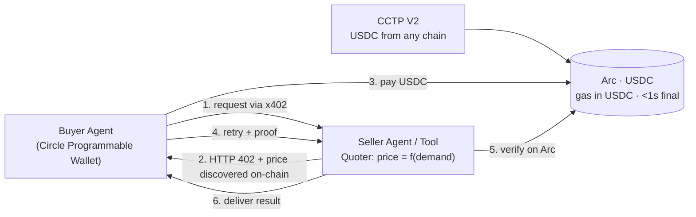

# Bank of Agent (BoA)
### Submitting for: **Best Agentic Economy with Circle Agent Stack**

**One line:** BoA is an **on‑chain, permissionless price‑discovery + payment layer for the
agent economy** — any AI agent tool (LLM, RAG, data API, compute) becomes a service other
agents buy **per‑use, in USDC, settled on Arc, with no human in the loop**.

---

## The innovation — the pricing mechanism (not just the payment)
Everyone can move USDC. Our contribution is **how the price is set**:

- **Agent‑native price discovery.** A service's price is **discovered by demand on a
  deterministic curve** (FOAMM, from ERC‑7527), not typed into a dashboard. Each purchase
  nudges the price along the curve — *the market of agents discovers the price*.
- **Permissionless & universal.** It's a drop‑in **`402` quote + USDC settlement** that
  **any agent tool stack** can adopt — no gatekeeper, no accounts, no API keys.
  Model‑, modality‑, and vendor‑agnostic.
- **A real smart‑contract use case for USDC.** Price discovery + settlement *are*
  programmable money: a pricing curve + USDC on Arc = autonomous agent‑to‑agent commerce.

> MVP today demonstrates demand/usage‑scaled pricing settled on Arc; the on‑chain FOAMM
> curve (ERC‑7527) is what makes discovery fully permissionless. Honest split below.

## How it works — agent‑to‑agent commerce, no human

1. **Buyer agent** (Circle Programmable Wallet) requests a tool via **x402**.
2. **Seller/tool** quotes a price **discovered by demand** → HTTP **402**.
3. Buyer **pays USDC on Arc** (gas in USDC, <1s final).
4. Buyer retries with proof; seller **verifies on‑chain** and delivers.
5. Agents fund themselves cross‑chain via **CCTP V2** (USDC from any chain → Arc).

## Why Arc — and the Circle stack we use
- **Gas is USDC** → nanopayments with **no separate gas token**; gasless for the payer via
  x402 / EIP‑3009. A $0.005 call is economically real.
- **Sub‑second deterministic finality** → payment is final *before* the API responds.
- **Circle tools:** **Arc** · **USDC** · **x402** · **CCTP V2** · **Circle Programmable Wallets**.

## Live proof (real, on Arc testnet)
- **Settlement:** tx `0x46d80dbe…35ef68` — A `−1.00148` (1 USDC **+ gas in USDC**), B `+1.0`.
- **Agent pay‑per‑use:** 3 calls billed `0.00512 / 0.01024 / 0.02048` USDC; seller credited
  **exactly the total**; independently re‑verified via raw RPC.
- **Run it:** `cd spikes/arc && npm run demo` · explorer `https://testnet.arcscan.app`.

## Bounty qualification map
| Requirement | Where |
| --- | --- |
| **Functional MVP (frontend + backend)** | web app (price‑discovery + x402 demo) over the proven `spikes/arc/` backend |
| **Architecture diagram** | above (and rendered in‑app) |
| **Effective use of Circle dev tools** | Arc, USDC, x402, CCTP V2, Programmable Wallets |
| **Gas‑free agent micropayments, no human** | x402 pay‑per‑use on Arc, gas in USDC; demo runs autonomously |
| **GitHub repo** | `https://github.com/lanyinzly/BankOfAgent-ETHNYC` · branch `claude/lucid-goodall-f6lbt8` · `spikes/arc/` |

*Built at ETHGlobal NY · Agent economy settled on Arc + USDC.*
